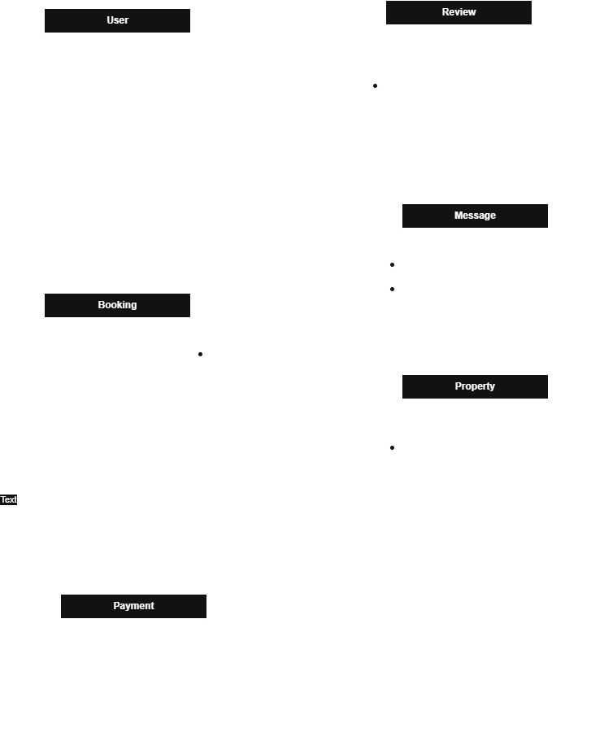

# ERD Requirements
##  ER Diagram

##  Key Entities & Relationships

### User
 `user_id` (PK)
 `email`, `first_name`, `last_name`, `role`, etc.
 A user can host properties, make bookings, send messages, and write reviews

### Property
 `property_id` (PK)
 `host_id` (FK → User)
 A property can have many bookings and reviews

### Booking
 `booking_id` (PK)
 `user_id`, `property_id` (FKs)
 One booking links a guest to a property

### Payment
 `payment_id` (PK)
 `booking_id` (FK)
 One payment per booking

### Review
 `review_id` (PK)
 `user_id`, `property_id` (FKs)
 A user can leave a review for a property

### Message
 `message_id` (PK)
 `sender_id`, `recipient_id` (FKs)
 Users can send messages to one another

